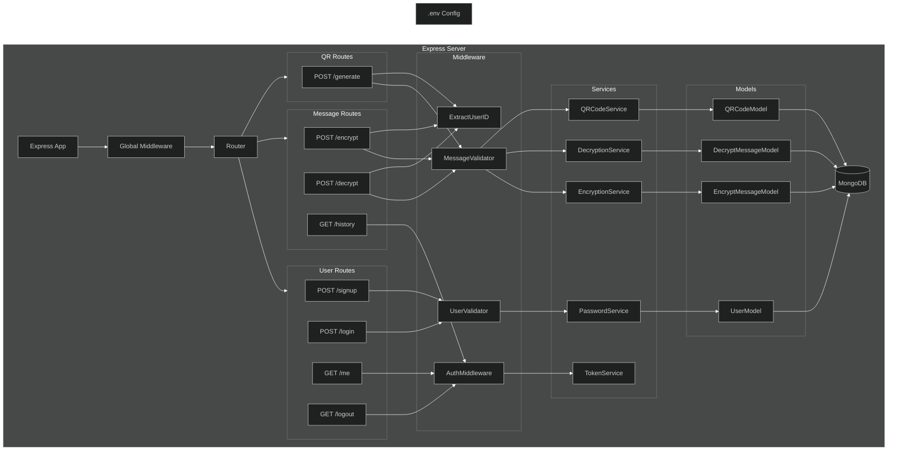

# Backend - My Encryption App

## Project Overview

This backend handles the core functionalities of the My Encryption App, including user authentication, message encryption/decryption, QR code generation, and more.

## Project Structure


## Installation

1. Clone the repository:
   ```sh
   git clone https://github.com/Skizzy-create/my-encryption-app.git
   cd my-encryption-app/backend
   ```

2. Install dependencies:
   ```sh
   npm install
   ```

3. Set up environment variables:
   Create a `.env` file in the `backend` directory with the following variables:
   ```env
   PORT=3000
   JWT_SECRET=your_jwt_secret
   DB_CONNECTION_STRING=your_database_connection_string
   ```

## Usage

1. Start the server:
   ```sh
   npm start
   ```

2. The backend server will run on `http://localhost:3000`.

## API Endpoints

- **Authentication Routes**:
  - `POST /api/v1/register`: Register a new user
  - `POST /api/v1/login`: Authenticate and obtain a JWT

- **Encryption Routes**:
  - `POST /api/v1/encrypt`: Encrypt a message
  - `POST /api/v1/decrypt`: Decrypt a message

- **QR Code Routes**:
  - `POST /api/v1/generate-qr`: Generate a QR code for an encrypted message
  - `POST /api/v1/scan-qr`: Scan and decrypt a QR code

## Configuration

- **Database**: MongoDB is used for storing user information, encrypted messages, and QR codes.
- **Environment Variables**: Ensure the `.env` file contains the correct values for `PORT`, `JWT_SECRET`, and `DB_CONNECTION_STRING`.

## Contributing

Contributions are welcome! Please follow the standard GitHub workflow:

1. Fork the repository
2. Create a new branch (`git checkout -b feature/your-feature`)
3. Commit your changes (`git commit -m 'Add your feature'`)
4. Push to the branch (`git push origin feature/your-feature`)
5. Open a pull request

---

For further details, refer to the [Project Documentation](https://github.com/Skizzy-create/my-encryption-app/blob/bba68754fdfb8e28d9ceecf5aef69aa9d8bd4d56/Backend/Project-Doc.md).

You can view more code files [here](https://github.com/Skizzy-create/my-encryption-app).
